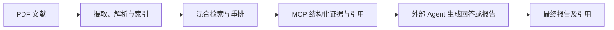
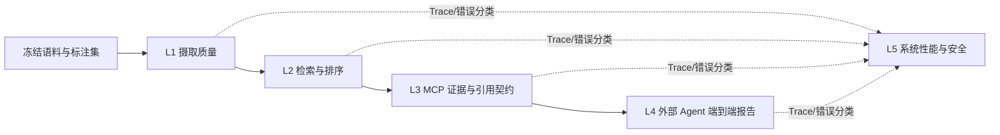

# 模块化文献 RAG 系统优化与评测技术调研

> 版本：v1.0  
> 日期：2026-08-14  
> 适用范围：当前 `MODULAR-RAG-MCP-SERVER` 代码库、10 篇已摄取文献，以及由外部 Agent 调用 MCP Tools 生成最终报告的部署方式

## 1. 执行摘要

当前项目已经具备一条完整且有辨识度的“学术文献证据服务”主链：PDF 摄取、增量幂等、Dense + BM25 混合检索、RRF 融合、可选重排、结构化引用、多模态附件、MCP Tool Calling、Trace 与 Ragas 接入。与 RAGFlow、Dify、Haystack、LlamaIndex、Microsoft GraphRAG 等开源方案相比，项目的核心问题不是缺少更多框架名词，而是以下三点：

1. **评测结论目前不够可信。** 现有确定性指标只有 Hit Rate 和 MRR；端到端门槛为 0；评测执行器没有真正应用 `collection`；默认 Ragas 答案只是拼接前 5 个检索块，而不是外部 Agent 的最终回答；50 条 `paper_golden_set` 是占位式合成数据，不能作为真实性能证据。
2. **证据契约还需要稳定化。** 当前引用输出是优势，但仍应从易变化的 chunk ID 升级为“文档版本 + 页码/章节 + 原文跨度哈希”的稳定定位，并对引用正确性单独设门槛。
3. **生产闭环不足。** 本地 JSONL Trace、Streamlit 和 ChromaDB 适合个人项目，但尚缺认证授权、集合级访问控制、速率限制、健康检查、OpenTelemetry、可恢复摄取任务、索引版本与备份迁移机制。

本报告建议先完成 **P0 评测可信化**，再做 **P1 检索与工程可靠性**，最后依据错误数据决定是否引入 GraphRAG、更多存储后端或复杂工作流。对于目前 10 篇文献的规模，不建议先复制 RAGFlow/Dify 的完整 UI 和平台能力。

## 2. 系统边界与调研方法

### 2.1 系统边界

本项目不是完整的“报告生成系统”，而是面向外部 Agent 的文献证据后端：



因此应拆分两层责任：

- **项目内责任**：文档解析、索引、召回、排序、元数据、证据定位、MCP 返回协议、时延与错误。
- **外部 Agent 责任**：问题理解、工具调用策略、跨文献综合、报告组织、最终陈述与引用使用。

评测也必须分层。只评检索不能证明最终报告可信；只评最终回答又无法定位到底是解析、检索、引用还是 Agent 推理出了问题。

### 2.2 调研方法

本报告采用三类证据：

- **本地证据**：知识图谱、源码、配置、测试夹具与评测脚本。
- **开源系统一手资料**：官方代码仓库和官方文档。
- **评测研究一手资料**：RAGAS、RAGChecker、BEIR、MIRACL 等论文与官方实现。

对开源系统的比较不是“功能数量排名”，而是回答三个问题：项目现有优势是什么、下一步最值得补什么、哪些能力在当前规模下不值得做。

## 3. 当前项目能力盘点

| 维度 | 已实现能力 | 当前边界 |
|---|---|---|
| 摄取 | PDF 到 Markdown、切分与增强、图表处理、Dense/Sparse 双路编码、SHA256 幂等 | CLI 默认只接收 PDF；缺少任务队列、断点恢复、索引版本发布 |
| 检索 | Dense 与 BM25 并行召回、RRF、单路失败回退、元数据过滤、参考文献块降权 | 缺少 nDCG/Recall 等质量基线、查询路由、父子块与邻块扩展、动态候选预算 |
| 重排 | Cross-Encoder 与 LLM Rerank，可失败回退 | 尚无系统化消融，无法证明成本和收益 |
| 引用 | Markdown 引用、结构化 citations、BibTeX、图表关联 | 引用稳定性和定位准确率没有独立评测；chunk ID 易随重切分变化 |
| MCP | 4 个 Tools：查询、集合列表、文档摘要、BibTeX 导出 | 外部 Agent 的工具调用与最终报告未纳入当前 EvalRunner |
| 可观测性 | JSONL Trace、Streamlit 面板、阶段耗时信息 | 非分布式 Trace；缺少统一 run/config/corpus 版本和线上 SLI |
| 评测 | Hit Rate、MRR、Ragas 基础指标 | 指标太少、测试门槛为 0、集合过滤失效、合成占位集污染结论 |
| 模块化 | Embedding、LLM、Reranker、Vector Store 抽象及工厂模式 | Vector Store 实际只注册 Chroma；“可插拔”需要契约测试证明 |
| 治理 | 本地数据管理、部分并发与 WAL | 缺少认证、ACL、配额、审计、备份恢复和迁移策略 |

关键本地证据：

- `CustomEvaluator` 只支持 `hit_rate` 与 `mrr`：[`src/libs/evaluator/custom_evaluator.py`](../src/libs/evaluator/custom_evaluator.py)。
- `EvalRunner` 接收 `collection`，但检索调用未透传该参数；无生成器时将前 5 个块拼成“答案”：[`src/observability/evaluation/eval_runner.py`](../src/observability/evaluation/eval_runner.py)。
- 召回回归阈值当前为 `0.0`：[`tests/e2e/test_recall.py`](../tests/e2e/test_recall.py)。
- 12 条具有证据字段的结构化 golden case 与 50 条占位式合成 case 并存；前者也仍需人工复核来源真实性：[`tests/fixtures/golden_test_set.json`](../tests/fixtures/golden_test_set.json)、[`tests/fixtures/paper_golden_set.json`](../tests/fixtures/paper_golden_set.json)。
- 目前仅自动注册 Chroma Store：[`src/libs/vector_store/__init__.py`](../src/libs/vector_store/__init__.py)。

## 4. 与代表性开源 RAG 系统对比

### 4.1 对比矩阵

| 系统 | 主要定位 | 值得借鉴 | 本项目不必照搬 |
|---|---|---|---|
| 本项目 | 面向 Agent 的轻量学术文献证据 MCP Server | 学术 PDF 主链、混合检索、结构化引用、外部 Agent 解耦 | — |
| RAGFlow | 文档理解、知识库、工作流与应用一体化平台 | 多格式解析、模板化切分、多路召回、引用、知识库运营 | 完整 Web 产品、团队管理和大规模基础设施 |
| Dify | LLM 应用/工作流平台及知识检索组件 | 多知识库路由、自动/手动元数据过滤、检索配置产品化 | 应用编排平台、Marketplace、前端运营体系 |
| Haystack | 组件化 RAG/Agent Pipeline 框架 | 组件级与端到端分层评测、MAP/MRR/nDCG/Recall、统计比较、OTel | 重新改写全部流水线为另一套框架 |
| LlamaIndex | 数据接入、索引、检索与 Agent 工作流框架 | 摄取缓存、文档去重、异步流水线、路由检索、可观测接口 | 大量通用 Connector；当前仅 10 篇 PDF 时收益有限 |
| Microsoft GraphRAG | 面向跨文档全局问题的知识图谱 RAG | Local/Global/DRIFT 查询模式，适合主题归纳与跨文献关系 | 在没有跨文档失败证据前直接承担图谱构建成本 |

RAGFlow 官方资料强调深度文档理解、异构格式、混合检索、融合重排和引用；其工程范围明显大于本项目。[RAGFlow README](https://github.com/infiniflow/ragflow) [RAGFlow RAG basics](https://github.com/infiniflow/ragflow/blob/main/docs/basics/rag.md)

Dify 的官方检索实现包含多数据集路由、自动/手动元数据过滤、加权检索、Top-K、阈值和重排，说明“检索策略配置化”是成熟平台的重要能力。[Dify dataset retrieval](https://github.com/langgenius/dify/blob/main/api/core/rag/retrieval/dataset_retrieval.py)

Haystack 将检索指标和生成指标分开，并提供 MAP、MRR、nDCG、Recall、上下文相关性和忠实性等评测器，同时支持统计评测与 OpenTelemetry Trace。[Haystack evaluation](https://docs.haystack.deepset.ai/docs/evaluation) [Haystack evaluators](https://docs.haystack.deepset.ai/docs/evaluators) [Haystack statistical evaluation](https://docs.haystack.deepset.ai/docs/statistical-evaluation) [Haystack tracing](https://docs.haystack.deepset.ai/docs/tracing)

LlamaIndex 的摄取流水线支持 transformation cache、基于文档哈希的重复管理、向量库写入以及异步/并行执行，可作为摄取任务可恢复化的参考。[LlamaIndex ingestion pipeline](https://docs.llamaindex.ai/en/v0.10.17/module_guides/loading/ingestion_pipeline/root.html)

Microsoft GraphRAG 将查询分为 Local、Global、DRIFT 和 Basic Search；其中 Global Search 通过社区报告与 map-reduce 回答全数据集问题，适用于“多篇论文的主要主题与分歧是什么”这类全局问题，但其索引会额外提取实体、关系、声明与社区摘要。[GraphRAG query overview](https://microsoft.github.io/graphrag/query/overview/) [GraphRAG indexing overview](https://microsoft.github.io/graphrag/index/overview/)

### 4.2 综合判断

本项目与大型开源平台的合理差异是“聚焦”，不是缺陷。应保留以下定位：

- 专注文献证据，而不是通用聊天机器人平台。
- 通过 MCP 向外部 Agent 提供能力，而不是在服务内绑定某个 Agent 框架。
- 本地优先、可替换模型、可核验引用，而不是先追求多租户 SaaS。

真正需要追赶的不是 UI 和 Connector 数量，而是成熟系统共有的三项底座：**评测可复现、证据可定位、运行可观测**。

## 5. 优化建议与优先级

### 5.1 P0：先让评测结果可信（1–2 周）

| 项目 | 当前风险 | 建议验收标准 |
|---|---|---|
| 修复 collection 透传 | 多集合评测可能检到错误集合 | 单元测试证明每个 case 只检索目标集合 |
| 区分“零召回”和“基础设施失败” | 异常被吞掉并返回空列表，指标含义失真 | 每个 query 记录 `status/error_type`；失败计入失败率，不伪装成质量 0 分 |
| 清理 golden set | 50 条占位问题会制造虚假样本量 | 移出正式评测入口并标记 `synthetic_fixture_only` |
| 扩展检索指标 | Hit/MRR 无法衡量多证据排序 | 至少输出 Recall@K、Precision@K、nDCG@K、MRR@K、文档覆盖率 |
| 接入真实 Agent 结果 | 当前 Ragas 只评前 5 个块拼接文本 | 保存 Agent 最终答案、工具调用、引用和上下文，单独跑端到端指标 |
| 非零质量门槛 | 当前 CI 阈值 0 永远无法阻止退化 | 先以冻结基线的相对退化门槛发布，数据成熟后再设绝对门槛 |

### 5.2 P1：提升证据质量，而不是盲目增加召回策略（2–4 周）

1. **稳定证据定位符**
   
   建议引用主键为：`corpus_version + document_id + page/section + span_hash`。chunk ID 只作本次索引内部字段。重切分后，只要原文跨度不变，引用仍可核验。

2. **章节感知与父子块检索**
   
   小块用于向量匹配，父段/章节用于返回上下文；命中后按配置补充前后邻块。重点解决定义被截断、表格说明与表格分离、跨段论证不完整。

3. **动态检索预算**
   
   按查询类型决定候选数和重排：事实问题用较小 Top-K；比较、多跳问题扩大候选并要求跨文档覆盖。不要对所有查询固定同一 Top-K。

4. **查询改写与多查询召回**
   
   只在同义改写、缩写扩展和复杂问题拆分的失败切片上启用。改写前后都保留 Trace，以便判断收益与漂移。

5. **去重与多样性约束**
   
   对相邻重叠块、同一章节近重复块做合并；比较类问题可对文档设置最小覆盖或用 MMR，避免 Top-K 被单篇论文占满。

6. **索引事务与版本一致性**
   
   Dense、BM25、SQLite 元数据与附件应共享一个 index build ID。只有全部写入成功才切换 active version，防止双路索引不同步。

### 5.3 P1：生产可靠性与安全（2–4 周，可与检索并行）

- 摄取改为可查询状态、可重试、可恢复的后台任务；记录每阶段产物与错误。
- 增加 `/health`、`/ready` 或等价 MCP diagnostics，分别验证进程、模型、Chroma、BM25 与元数据存储。
- Trace 增加统一 `trace_id/run_id`，并预留 OpenTelemetry exporter；线上观测 p50/p95、失败率、回退率、空结果率和 token/cost。
- 加入 API/MCP 客户端身份、集合级 ACL、并发/速率限制及审计日志。个人本地使用可默认关闭，但契约应存在。
- 建立备份、恢复演练、schema/index migration 和 corpus manifest。
- 将检索到的文档内容视为不可信输入，增加间接提示注入测试、可疑指令标记和 Agent 侧内容/指令隔离。OWASP 明确指出 RAG 不能消除提示注入风险，恶意文档可通过知识库影响模型行为。[OWASP LLM01 Prompt Injection](https://genai.owasp.org/llmrisk/llm01-prompt-injection/) [OWASP LLM08 Vector and Embedding Weaknesses](https://genai.owasp.org/llmrisk/llm082025-vector-and-embedding-weaknesses/)

### 5.4 P2：由评测数据决定是否建设

- **GraphRAG/全局检索**：当“跨 5–10 篇文献归纳主题、争议和关系”的测试持续失败，且失败不是召回预算或上下文组织导致时再引入。
- **更多格式/Connector**：出现真实 DOCX、HTML、PPT 或 Zotero 批量导入需求时再做。
- **Qdrant/Milvus/Elasticsearch 等存储**：当数据量、并发、过滤性能或部署约束达到 Chroma 的瓶颈时再实现，并用同一套 provider contract tests 验证。
- **完整 Web 工作台**：如果目标转为多人知识库运营再建设；当前 Streamlit 保持诊断面板即可。

## 6. 评测总体设计

### 6.1 分层评测框架



RAGAS 将 RAG 评测拆为检索上下文的相关性、生成忠实性和答案质量；RAGChecker进一步提供 claim-level 的检索与生成诊断。二者适合补充人工评测，但不能替代固定语料上的确定性指标。[RAGAS paper](https://aclanthology.org/2024.eacl-demo.16/) [RAGChecker paper](https://arxiv.org/abs/2408.08067) [RAGChecker repository](https://github.com/amazon-science/RAGChecker)

### 6.2 从 10 篇文献、10 条标注如何起步

现有 10 条人工问题可作为 **Smoke Set**，用来验证链路是否跑通和明显回归，但不能支撑“系统质量 0.8+”的泛化结论。建议在同一批 10 篇文献上先构建 80 条 Core Set：

| 类型 | 数量 | 目的 |
|---|---:|---|
| 事实/定义 | 15 | 验证直接证据召回 |
| 同义改写/缩写 | 10 | 验证 Dense 与查询改写收益 |
| 数值/表格 | 10 | 验证结构化内容解析与定位 |
| 图片/图注 | 10 | 验证多模态附件和图文关联 |
| 指定章节/方法 | 10 | 验证元数据和章节定位 |
| 跨论文比较 | 10 | 验证文档多样性与对齐 |
| 多跳/综合 | 10 | 验证多证据覆盖与 Agent 综合 |
| 不可回答/对抗性 | 5 | 验证拒答、越权与提示注入防护 |
| **合计** | **80** | — |

每条测试样本至少标注：

```json
{
  "query_id": "cross_doc_001",
  "query": "……",
  "query_type": "cross_document_comparison",
  "answerable": true,
  "expected_documents": ["doc_a", "doc_b"],
  "evidence": [
    {
      "document_id": "doc_a",
      "page": 7,
      "section": "Methods",
      "text_span": "……",
      "span_hash": "sha256:……",
      "relevance": 3
    }
  ],
  "reference_answer": "……",
  "required_claims": ["……"],
  "forbidden_claims": ["……"],
  "annotator": "human_01",
  "review_status": "verified"
}
```

标注原则：

- 相关性使用 0–3 四级：0 无关、1 背景相关、2 可辅助回答、3 直接支撑。
- 不只标一个 chunk ID，要标原文证据跨度；允许一题多个正确证据。
- 先由本人标注，再间隔一周盲审一次；若能邀请第二人，抽查至少 20% 并记录分歧。
- 冻结 `corpus_manifest.json`，记录文件 SHA256、解析器、chunk 配置、embedding 模型和 index build ID。
- Core Set 划分为开发集 50、测试集 30；调参只看开发集，最终一次性报告测试集。
- 后续新增文献时保留“新文档留出集”，验证系统不是只适配这 10 篇。

### 6.3 指标体系

#### L1：摄取质量

| 指标 | 定义 |
|---|---|
| 文档解析成功率 | 成功产生可索引正文的文档 / 输入文档 |
| 页覆盖率 | 可追溯文本页 / 应解析页 |
| 标题层级准确率 | 抽样标题的层级与边界准确比例 |
| 表格/图片覆盖率 | 成功提取且能关联原页的目标表格/图片比例 |
| 元数据准确率 | 标题、作者、年份、DOI 等字段的 exact/normalized match |
| 幂等一致性 | 相同文件重复摄取后记录数、ID、索引版本是否稳定 |

#### L2：检索与排序

主指标建议为：

- `Recall@5/10/20`：正确证据是否进入候选集。
- `nDCG@10`：使用 0–3 级相关性评估排序质量。
- `MRR@10`：第一个直接证据出现得是否足够早。
- `Precision@5`：前排结果噪声。
- `Document Recall@K`：跨论文问题所需文档是否都覆盖。
- `Evidence Span Recall/Precision`：返回块是否覆盖人工标注的证据跨度。

BEIR 证明跨域检索表现差异显著，BM25 仍是稳健基线，而强重排方法通常伴随更高计算成本。因此所有改动都应同时与 BM25-only、Dense-only 比较，不能只报告最终组合分数。[BEIR paper](https://arxiv.org/abs/2104.08663)

#### L3：MCP 证据与引用契约

- Citation locator accuracy：引用能否定位到正确文档、页/章节和原文。
- Citation precision：返回引用中真正支撑相邻陈述的比例。
- Citation recall：应引用的关键陈述中已经附带有效引用的比例。
- Broken locator rate：文档更新或重建索引后无法解析的引用比例。
- Source diversity/coverage：比较问题是否覆盖要求的论文，而非被单文档垄断。
- Schema validity：4 个 Tools 的输出能否通过固定 JSON Schema；错误响应是否可机器判别。

#### L4：外部 Agent 端到端

短问答评测：正确性、忠实性、答案相关性、完整性、拒答正确率。

长报告额外评测：

- Claim coverage：参考关键主张覆盖率。
- Claim faithfulness：每个事实主张是否被已返回证据支持。
- Citation coverage：需要引用的主张中有引用的比例。
- Citation entailment：引用证据是否真正支持该主张。
- Contradiction handling：文献冲突时是否呈现分歧，而非强行合并。
- Tool-use success：需要几次查询、是否出现无效循环、是否使用了错误集合。

LLM-as-a-Judge 只能作辅助指标。应先在人工评分子集上校准 rubric，报告与人工的一致率；成对比较要交换候选顺序，避免位置偏差。研究已观察到不同 Judge 和任务上的系统性位置偏差。[Position bias in LLM-as-a-Judge](https://arxiv.org/abs/2406.07791)

#### L5：性能、成本、稳定性与安全

- 各阶段 p50/p95 延迟：embedding、Dense、BM25、fusion、rerank、附件解析、总时延。
- 吞吐量、并发下错误率、超时率、空结果率、单路回退率。
- 每查询 embedding/LLM token 与成本；每文档摄取耗时和存储增长。
- 冷启动与热缓存差异；索引重建和恢复耗时。
- 跨集合数据泄露率、提示注入攻击成功率、恶意文档污染影响。

### 6.4 实验矩阵与消融

第一轮只做能解释收益的最小矩阵：

| 实验组 | 变量 | 目的 |
|---|---|---|
| 检索基线 | BM25-only / Dense-only / RRF | 证明混合检索是否真实增益 |
| 重排 | RRF / RRF + Cross-Encoder / RRF + LLM | 比较质量、延迟和成本 |
| 切分 | 400 / 800 / 1200 tokens；递归 / 章节感知 | 找到不同问题类型的最佳证据粒度 |
| 候选预算 | retrieve 10/20/40；return 5/10 | 检查召回饱和点与重排收益 |
| RRF | `k=20/60/100` | 验证融合参数敏感性 |
| 上下文 | 原始块 / 邻块扩展 / 父子块 | 解决证据不完整问题 |
| 查询策略 | 原查询 / 同义改写 / 多查询分解 | 只在对应失败切片验证 |

实验规则：

- 一次只改变一个主要因素；冻结语料、模型版本、prompt 和随机参数。
- 每次运行记录 Git SHA、配置哈希、语料 manifest、索引 build ID 和依赖版本。
- 对随机生成/LLM Judge 至少重复 3 次并报告均值、标准差；关键对比使用配对 bootstrap 95% 置信区间。
- 同时报告总体分数和 query type 切片，防止总体提升掩盖表格或跨文档问题退化。
- 公开基准只作外部压力测试。MIRACL 可用于中文/多语言检索回归，但不能替代本项目文献域标注集。[MIRACL paper](https://arxiv.org/abs/2210.09984) [MIRACL repository](https://github.com/project-miracl/miracl)

### 6.5 首版发布门槛

当前样本太少，不宜直接拍脑袋规定“Recall@10 必须 0.9”。首版门槛应绑定冻结基线：

| 类别 | 建议首版 Gate |
|---|---|
| 检索质量 | Recall@10、nDCG@10 相对已发布基线下降不超过 2 个百分点 |
| 引用 | locator accuracy ≥ 95%；broken locator rate = 0 |
| 忠实性 | 人工抽查 unsupported claim rate ≤ 2% |
| 稳定性 | 可回答测试集基础设施失败率 = 0；异常必须显式记录 |
| 性能 | 同硬件、同配置下 p95 总时延回退不超过 20% |
| 安全 | 跨集合越权返回 = 0；测试恶意文档不得改变工具权限或系统指令 |

当 Core Set 达到 80 条且至少有一轮复审后，再基于历史分布设绝对质量阈值。

## 7. 评测运行产物设计

每次评测输出一个不可覆盖的 run 目录：

```text
evaluation_runs/<run_id>/
├── manifest.json
├── query_results.jsonl
├── aggregate_metrics.json
├── slice_metrics.json
├── failures.jsonl
├── agent_outputs.jsonl
└── report.md
```

`query_results.jsonl` 最少记录：

```json
{
  "run_id": "2026-08-14T120000Z_ab12cd3",
  "git_sha": "ab12cd3",
  "corpus_manifest_hash": "sha256:...",
  "config_hash": "sha256:...",
  "query_id": "fact_001",
  "status": "success",
  "retrieved": [{"document_id": "...", "page": 4, "score": 0.81}],
  "fallbacks": [],
  "timings_ms": {"dense": 80, "bm25": 12, "rerank": 0, "total": 101},
  "metrics": {"recall_at_10": 1.0, "ndcg_at_10": 0.92},
  "agent_answer": null,
  "citations": [],
  "error": null
}
```

必须保留失败样本，不允许因异常得到空 metrics 后从平均值分母中消失。

## 8. 错误分类与诊断闭环

每个失败 case 只设一个主因，可附多个次因：

1. `INGESTION_PARSE`：正文、公式、表格、图片解析错误。
2. `CHUNK_BOUNDARY`：证据被切断或块上下文不足。
3. `RETRIEVAL_MISS`：正确证据未进入候选集。
4. `RANKING_ERROR`：已召回但排名过低。
5. `DOCUMENT_COVERAGE`：跨文档问题缺少某篇关键论文。
6. `CITATION_LOCATOR`：引用无法回到正确原文。
7. `TOOL_CONTRACT`：Schema、集合、超时或错误处理失败。
8. `AGENT_TOOL_USE`：Agent 未调用、错调用或循环调用工具。
9. `UNSUPPORTED_SYNTHESIS`：Agent 生成了证据不支持的陈述。
10. `UNANSWERABLE_FALSE_POSITIVE`：没有证据时仍给出确定答案。
11. `SECURITY_INJECTION`：检索文档中的指令影响了 Agent 行为。

每轮优化只从失败数最多或风险最高的类别中选 1–2 项，修改后重跑全量回归。这样才能判断究竟该优化切分、检索、重排、引用还是 Agent Prompt。

## 9. 四周实施路线图

### 第 1 周：评测可信化

- 修复 `collection` 透传与异常吞噬。
- 将 50 条占位集合移出正式评测。
- 定义 v2 golden schema、corpus manifest 和 run artifact。
- 在现有 10 条人工问题上补齐页码、章节、证据跨度。
- 增加 Recall@K、Precision@K、nDCG@K 和分切片报告。

**完成标准**：同一提交与配置重复运行结果一致；任何异常可定位；CI 不再使用 0 门槛。

### 第 2 周：扩充标注与建立基线

- 按 8 类扩充至 40–50 条开发集。
- 跑 BM25、Dense、RRF、RRF + Rerank 四组基线。
- 对失败样本完成错误归因。
- 建立 citation locator 测试。

**完成标准**：能回答“混合检索和重排分别提升了什么、代价是多少”。

### 第 3 周：针对性优化

- 依据失败占比选择章节感知/父子块、邻块扩展、动态 Top-K 或多样性约束。
- 接入外部 Agent Trace 和最终答案。
- 增加端到端忠实性、引用覆盖、拒答评测。

**完成标准**：优化在开发集有统计和切片证据，且没有明显性能回退。

### 第 4 周：冻结测试与发布门槛

- 扩充至 80 条，冻结 30 条测试集。
- 运行人工复审与 LLM Judge 校准。
- 加入 p95、回退率、故障注入、越权和提示注入测试。
- 输出首份带版本、置信区间和失败案例的 Evaluation Report。

**完成标准**：一次命令产生完整、不可覆盖、可追溯的评测目录；CI 根据已发布基线阻止退化。

## 10. 不建议现在做的事情

- 不要仅凭 10 条问题的 Hit≈0.8 宣称整体 RAG 准确率 80%。Hit@K 只说明至少一个标注证据进入 Top-K，且区间会非常宽。
- 不要把自动化测试“收集到多少项”当作效果指标；测试数量只能说明工程覆盖意愿，不能证明检索和报告质量。
- 不要在没有错误切片前引入 GraphRAG、Agentic RAG、更多数据库；复杂度本身不是质量。
- 不要只使用 Ragas/LLM Judge 给一个总分；必须保留确定性检索指标、人工证据标注和具体失败样本。
- 不要让 chunk ID 成为长期引用主键；任何切分参数变化都可能使引用失效。
- 不要把外部 Agent 生成的报告成绩全部归因于本项目；应分别报告 Retrieval/MCP 与 Agent E2E 两组成绩。

## 11. 预期优化后的项目表述

完成 P0/P1 后，项目可以有证据地表述为：

> 面向外部 Agent 的模块化学术文献证据服务，支持增量 PDF 摄取、Dense + BM25 + RRF 混合检索、可选重排和页/章节级结构化引用；建立分层评测集，对摄取、Recall/nDCG、引用定位、Agent 忠实性及 p95 延迟进行版本化回归，并对多集合隔离、失败回退与间接提示注入进行测试。

具体指标必须等冻结测试集跑完后再填，不预先制造漂亮数字。

## 12. 结论

项目已有足够好的主干，不需要推倒重来。与开源 RAG 系统相比，最值得优化的顺序是：

1. 修复评测执行器和数据集问题，建立可信基线。
2. 稳定引用定位与运行产物，让每个结论可复现、每个失败可诊断。
3. 基于失败切片优化章节/父子块、动态候选、跨文档覆盖和查询策略。
4. 补齐任务恢复、Telemetry、权限与安全测试。
5. 只有在跨文档全局问题确实成为主要瓶颈时，再评估 GraphRAG。

这条路径比堆叠更多模块更能提升项目的技术可信度，也能让后续简历或面试中的指标经得住追问。

## 参考资料

- [RAGFlow official repository](https://github.com/infiniflow/ragflow)
- [Dify dataset retrieval implementation](https://github.com/langgenius/dify/blob/main/api/core/rag/retrieval/dataset_retrieval.py)
- [Haystack evaluation documentation](https://docs.haystack.deepset.ai/docs/evaluation)
- [LlamaIndex ingestion pipeline](https://docs.llamaindex.ai/en/v0.10.17/module_guides/loading/ingestion_pipeline/root.html)
- [Microsoft GraphRAG query overview](https://microsoft.github.io/graphrag/query/overview/)
- [RAGAS: Automated Evaluation of Retrieval Augmented Generation](https://aclanthology.org/2024.eacl-demo.16/)
- [RAGChecker: A Fine-grained Framework for Diagnosing RAG](https://arxiv.org/abs/2408.08067)
- [BEIR: A Heterogeneous Benchmark for Zero-shot Evaluation of Information Retrieval Models](https://arxiv.org/abs/2104.08663)
- [MIRACL: A Multilingual Retrieval Dataset Covering 18 Diverse Languages](https://arxiv.org/abs/2210.09984)
- [OWASP LLM01:2025 Prompt Injection](https://genai.owasp.org/llmrisk/llm01-prompt-injection/)
- [Judging the Judges: Position Bias in LLM-as-a-Judge](https://arxiv.org/abs/2406.07791)
