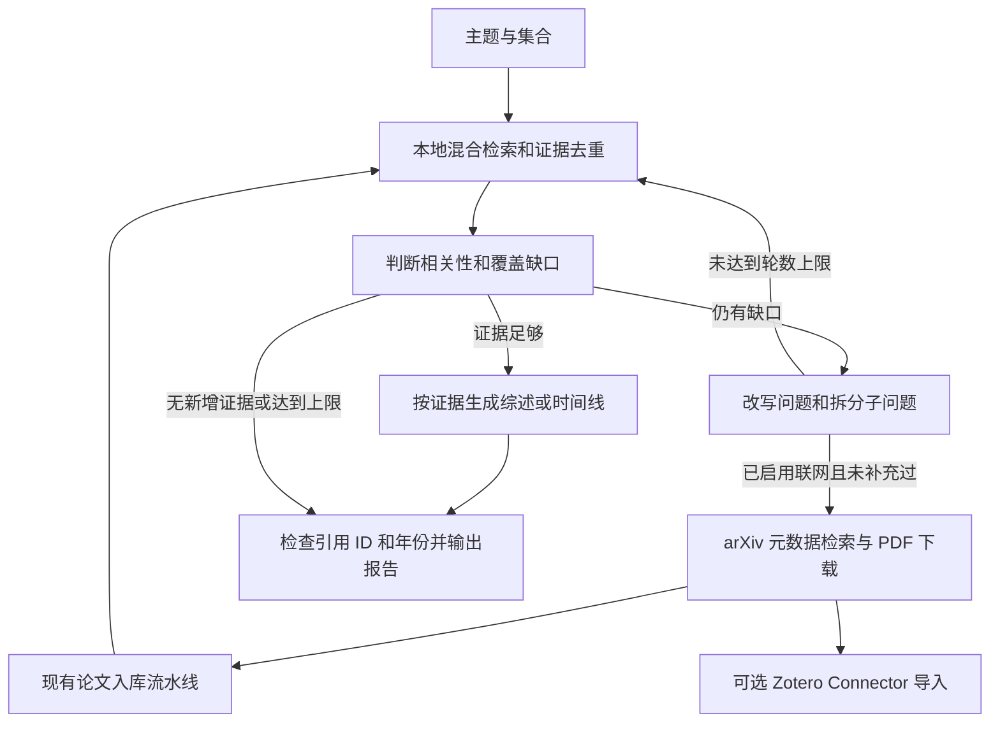

# 小型文献研究 Agent

在现有混合检索、分层证据和论文入库之上增加有界单 Agent，支持问题改写、证据缺口判断、综述草稿和发展时间线。默认只查本地库。它是内部研究原型，不是已经验证质量的系统综述系统。

## 工作流程



- 使用原始主题开始检索；每次模型请求都保留原始主题。
- 模型返回相关证据 ID、覆盖缺口、下一轮查询；代码决定是否继续以及是否允许联网。
- 默认最多 3 轮，每轮最多 2 个查询，每次取 5 条证据。硬上限为 5 轮、3 查询/轮、30 条片段，每片段最多 2400 字符，模型单次最多请求 3500 输出 token。
- 重复查询、没有新增证据、达到轮数上限均停止；空证据或没有确认相关的证据不生成实质综述。
- 综述至少需要两份不同来源；时间线还需两个有来源年份的时间点。这只是最低门槛，模型的“充分”不是学术完整性的证明。
- 每条生成论断必须关联已检索证据 ID。时间线年份必须与至少一个所引来源年份相同；不满足时过滤并记录警告。这个版本验证引用身份和年份，不自动验证语义蕴含，不把来源发表顺序当成技术因果关系。

## 命令行

使用项目虚拟环境和已有 `config/settings.yaml` 模型、Embedding、向量库设置。新模块没有增加第三方依赖，但实际论文解析仍需要项目原有的 PDF 依赖。

```powershell
# 本地文献综述
.venv\Scripts\python.exe scripts/research.py --topic "RAG 检索策略的发展与局限" --collection default --mode review

# 本地文献发展时间线
.venv\Scripts\python.exe scripts/research.py --topic "Agentic RAG 的发展脉络" --collection default --mode timeline

# 问答模式（允许单个相关来源）
.venv\Scripts\python.exe scripts/research.py --topic "查询改写怎样改善检索？" --mode answer

# 存在证据缺口时，自动补充至多 3 篇 arXiv 论文并加载到目标集合
.venv\Scripts\python.exe scripts/research.py --topic "Agentic retrieval augmented generation methods" --collection research_rag --mode review --allow-web --max-papers 3 --max-rounds 3

# 只读查看 Zotero 当前选中的目标
.venv\Scripts\python.exe scripts/research.py --show-zotero-target

# 用户明确指定已选中的目标后，同时导入 Zotero；把 C123 替换成实际输出的 target
.venv\Scripts\python.exe scripts/research.py --topic "Agentic RAG" --collection research_rag --allow-web --zotero-target C123
```

`--allow-web` 仅在缺口出现、且仍有后续检索轮次时触发一次获取批次；本地证据充分时不会强制下载。arXiv 词项搜索优先使用模型给出的补充查询；英语术语通常更适合该 API。`--max-rounds` 至少为 2，保证下载后还有一轮重新检索。

每次运行保存到独立的 `data/research/<run-id>/`：

| 文件 | 内容 |
| --- | --- |
| `report.md` | 带 `[E1]` 等来源标记的草稿、局限和证据索引 |
| `research.json` | 原始主题、模型名称、预算配置、每轮查询、证据、缺口、异常及获取记录 |
| `papers/*.pdf` | 启用联网后下载的全文 |
| `papers/manifest.json` | arXiv ID、日期、URL、SHA256、RAG 状态和 Zotero 状态 |
| `papers/references.ris` | 根据真实 API 元数据生成的 RIS，可手动导入 Zotero |

退出码：`0` 已生成达到最低覆盖判断的草稿；`2` 部分结果或证据不足；`1` 初始化/配置/运行错误。输出是草稿，即使退出码为 0 也需要核读原文。超时、检索失败或被过滤的论断会保留在 `warnings` 中，不能据此声称任务完全成功。

## MCP

服务启动时自动注册 `research_topic`，无需改动原来的 `query_knowledge_hub` 调用。示例参数：

```json
{
  "topic": "Agentic RAG 的方法分类与发展脉络",
  "mode": "review",
  "collection": "default",
  "max_rounds": 3,
  "top_k": 5
}
```

`mode` 可选 `review`、`timeline`、`answer`。响应包含 Markdown 和结构化 `structuredContent`。这个 MCP 工具只操作本地研究流程；自动下载/入库及 Zotero 写入由命令行显式选项启动。每个 MCP 调用创建独立检索工具实例，避免跨集合共享可变缓存。

## 文献与 Zotero 边界

- 第一版来源为 arXiv；论文标为预印本，不代表已经同行评审。尚未接入 OpenAlex、Semantic Scholar、Crossref、Unpaywall 或引文图遍历。
- 下载地址由有效 arXiv ID 构造，只允许 HTTPS arxiv.org/export.arxiv.org，重定向同样检查域名，拒绝任意 URL、内网地址和非 PDF 响应。单篇上限 25 MiB，单次网络超时 30 秒，同进程请求间隔至少 3 秒；多个进程还需外部统一限流。
- API 摘要仅用于发现和记录。综述依据是下载、入库后重新检索到的片段；下载或入库失败不会把摘要冒充全文证据。
- 复用 `IngestionPipeline`，附加标题、作者、年份、DOI 和 arXiv 身份。现有入库跳过缓存以文件哈希全局判断，不区分集合；显式获取采用 `force=True`，确保 PDF 曾在别的集合处理过时仍会加载到本次目标集合，代价是可能重复解析/Embedding。
- 保持原 `ZoteroLocalClient` 和 `sources.zotero.read_only=true` 不变。新增 `ZoteroConnector` 是单独的写入适配器，只有 `--zotero-target` 明确指定时启用。
- Connector 使用当前选中目标；调用前核对 `L<number>` / `C<number>` 以及可写状态。运行期间不要切换 Zotero 目标，因为检查和导入是两个请求，桌面目标选择并非原子事务。库 key 与此处的数字目标 ID 不相同。
- RIS 带 PDF URL；`import_accepted` 仅表示 Connector 返回导入记录，附件下载是否成功仍标为 `not_verified`，需在 Zotero 中核查。
- `data/state/research_zotero.sqlite3` 按无版本 arXiv ID + 目标记录已导入状态，避免本工具重复导入。它不会扫描/去重用户此前手动添加的条目。超时或未知结果保留 `pending`，需核查 Zotero 后人工处理；不自动删除条目或盲目重试。
- RAG 成功与 Zotero 失败分别记录；后者失败时 PDF、清单、RIS 及已有本地证据仍可使用。

## 开源实现调研与取舍（2026-09-06）

| 一手来源 | 核实到的做法 | 本项目的选择 |
| --- | --- | --- |
| [LangGraph Agentic RAG 官方教程](https://docs.langchain.com/oss/python/langgraph/agentic-rag) | 检索后判断相关性，不相关时改写问题并重新检索 | 采用相同的反馈流程，用 Python 实现小型有界循环，不新增编排框架 |
| [PaperQA2 官方仓库](https://github.com/Future-House/paper-qa) | 迭代查询、重排/上下文摘要、科学文献元数据和文内引用 | 复用已有检索/重排，新增跨轮证据集合和按来源生成草稿；未来再比较逐片段摘要和引文扩展 |
| [arXiv API 手册](https://info.arxiv.org/help/api/user-manual.html) | Atom 返回论文标识、作者、日期、摘要及 PDF 链接，支持词项查询 | 用标准库解析真实记录，再构造受限 PDF URL；先覆盖无需密钥的公开来源 |
| [Zotero Connector 文档](https://www.zotero.org/support/dev/client_coding/connector_http_server) 与 [实际接口源码](https://github.com/zotero/zotero/blob/main/chrome/content/zotero/xpcom/server/server_connector.js) | Connector 提供本地写入，import 使用当前目标和导入翻译器；Local API 读取与 Connector 导入用途不同 | 独立 opt-in 导入适配器，保留目标校验、导入日志和 RIS 回退 |

未整体引入 PaperQA2/LangGraph：当前仓库已经有检索、分块、引用和入库实现，再建一套索引会扩大第一版范围。后续是否迁移框架，应由恢复运行、长任务调度和质量评测结果决定。

## 验证与后续验收

离线行为测试见 `tests/unit/test_research_agent.py`、`test_research_acquisition.py`、`test_research_interfaces.py`。最终命令与证据记录在 `tasks/research_agent.md`。

已做真实 arXiv API 只读检索，成功解析返回的论文 ID、标题与日期。没有把模拟模型的通过率当成综述质量，也尚未执行真实模型综述、实际 PDF 入库或 Zotero 写入验收。

下一步以选定领域的 10–20 篇文献建立小型验收集：问题改写前后的命中率、论断与证据对应率、年份正确率、遗漏的重要方法、成本和时延；人工核验综述与时间线，再决定是否接入更多来源和 Dashboard。模型/检索调用有等待超时，但 Python 线程无法强制取消底层调用，PDF 解析/入库也不是硬墙钟上限；这个原型适合受控单任务使用，生产长任务需要进程隔离、取消与恢复机制。
