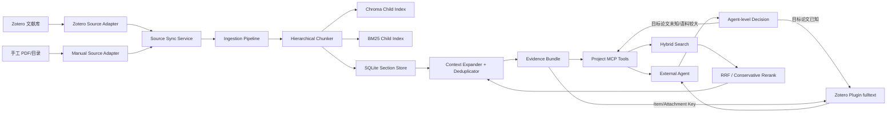

# Zotero 插件 × Agent 证据检索协同平台技术方案

> 文档状态：Implemented in code; real Zotero and formal corpus acceptance pending  
> 版本：1.2  
> 日期：2026-08-15  
> 适用项目：Modular RAG MCP Server  
> 目标读者：项目维护者、检索工程师、Agent 应用开发者

> 实施说明（2026-08-15）：Phase 0–3 的代码纵向链路已经落地，Phase 4 的 Dynamic Candidate-K、保守融合开关和既有消融框架已经接入。真实 Zotero Desktop smoke test、外部 Zotero 插件 fulltext handoff 以及扩大后冻结测试集的四方评测依赖用户本机环境和新增标注，不在代码单元测试中伪造通过。详见 [实施完成度报告](ZOTERO_AGENT_EVIDENCE_IMPLEMENTATION_REPORT.md) 与 [使用手册](ZOTERO_AGENT_EVIDENCE_USER_MANUAL.md)。

## 1. 执行摘要

本方案建议将项目从“多 PDF RAG 问答系统”重新定位为：

> 建立在 Zotero 文献管理和全文读取能力之上的、面向外部 Agent 的可追溯证据检索服务；系统从大型文献库中发现相关论文、章节和证据，再把 Zotero Item/Attachment Key 交给 Agent，由 Zotero 插件读取已知附件全文并完成标准引用。

Zotero 插件已经能够搜索本地文献库、获取已知附件的 indexed full text、导出 BibTeX 并向 Markdown/LaTeX 插入引用。因此本项目不再重复实现“已知论文全文读取”和“Zotero 引用操作”。Zotero 负责文献、全文和引用；本项目负责未知语料中的内容级语义发现、Hybrid Search、证据排序、章节定位、Trace 和质量评测。

本次改造不推倒现有架构。当前摄取流水线、Dense/BM25、RRF、MCP Tools、引用响应和评测体系均继续使用，在其上增加四项能力：

1. 面向语义索引的 Zotero 只读增量同步与来源身份映射；
2. Parent–Child 层级切分和章节/邻块扩展；
3. 面向 Agent 的“直接读全文或先做证据检索”协同路由；
4. 带 Zotero Item Key、Attachment Key、页码、分数和下一步动作的 Evidence Bundle。

## 2. 背景与问题判断

### 2.1 长上下文改变了 RAG 的适用边界

当用户只临时处理少量论文、全文能够放入模型上下文且任务需要整体理解时，直接提供全文通常比固定切块检索更简单，也不会发生正确证据未进入候选集的问题。在当前只有少量论文的一次性报告场景中，强制走完整 RAG 链路会增加解析、索引、检索和调参成本。

但长上下文没有替代以下能力：

- 持续增长文献库的增量维护；
- 数十至数百篇论文的候选筛选；
- 多个 Agent 对同一知识库的重复使用；
- 页码、章节和原始证据的稳定定位；
- 结构化引用和 BibTeX 身份关联；
- 检索过程的 Trace、回归和消融；
- 本地文献库的权限、版本和幂等处理。

Zotero 插件已经覆盖“已知附件全文读取”。因此目标架构不让本项目再次返回整篇全文，而是采用两级协同：目标论文已知时，Agent 直接调用 Zotero 插件读取全文；目标论文未知或语料过大时，先由本项目检索相关论文和证据，再把 Attachment Key 交给 Zotero 插件做全文深读。

### 2.2 当前项目已有基础

当前系统已经具备：

- PDF 加载、结构化处理、图片和表格能力；
- SHA256 幂等摄取；
- Dense + BM25 + RRF Hybrid Search；
- 可选 Rerank；
- Markdown citations 与结构化 citations；
- MCP stdio Server；
- `query_knowledge_hub`、`list_collections`、`get_document_summary`、`export_bibtex` 四个 MCP Tools；
- Trace、Streamlit 可观测界面；
- Hit、MRR、Precision@K、Recall@K、nDCG@K 评测；
- 不覆盖历史结果的版本化评测产物。

现有架构中，摄取编排集中在 `src/ingestion/pipeline.py`；查询编排集中在 `src/mcp_server/tools/query_knowledge_hub.py`；响应和引用集中在 `src/core/response/`；因此适合通过新增适配器、存储和路由组件进行渐进式扩展。

### 2.3 当前实测暴露的瓶颈

当前真实子集只有 3 篇论文、12 条人工问题和 15 个标注证据块，不能代表最初设想的 10 篇或更大规模语料。RRF Top-10 基线为：

| 指标 | 结果 |
|---|---:|
| Hit@10 | 1.0000 |
| Recall@10 | 0.9167 |
| MRR | 0.4856 |
| nDCG@10 | 0.5648 |

在同一组 RRF Top-20 候选上使用 Cross-Encoder 后：

| 指标 | RRF | Cross-Encoder |
|---|---:|---:|
| Hit@10 | 1.0000 | 0.9167 |
| Recall@10 | 0.9167 | 0.8611 |
| MRR | 0.4856 | 0.6227 |
| nDCG@10 | 0.5648 | 0.6779 |

结果说明：

- Rerank 能改善候选集内的证据顺序；
- 完全覆盖 RRF 排名会将个别正确证据挤出 Top-10；
- 有两条标注证据没有进入某个问题的 Top-20，Rerank 无法修复候选池外的缺失；
- 下一阶段应优先提升切分完整性、候选召回和上下文扩展，再做保守分数融合。

## 3. 与 Zotero 的能力边界

### 3.1 Zotero 负责的能力

- 文献条目、作者、年份、DOI 等书目元数据；
- 收藏夹、标签、附件和 PDF 阅读；
- BibTeX、RIS、CSL 和文字处理软件引用工作流；
- 文献去重、同步和成熟的用户操作界面；
- 文献全文的基础索引和读取入口。

其中“读取全文”指通过已知 Attachment Key 获取 Zotero 已索引的全文。它解决的是内容访问，不等价于在整个文献库中执行 Dense + BM25 + RRF 的证据级语义排序。

### 3.2 本项目负责的能力

- 对论文内容进行结构化解析和层级切分；
- 使用 Embedding 和 BM25 做语义与关键词联合召回；
- 对同义表达、专业术语和多证据问题进行证据级检索；
- 将命中块扩展为父章节或相邻上下文；
- 向外部 Agent 返回结构化 Evidence Bundle；
- 保留 Dense、BM25、RRF、Rerank 的分数与 Trace；
- 建立冻结测试集和检索回归门禁。

### 3.3 产品定位

不将本项目宣传为“另一个 Zotero”或“PDF 聊天工具”。推荐表述：

> 本项目是 Zotero 与外部 Agent 之间的智能证据层：Zotero 管理文献和引用身份，本项目定位、组织并评测能够支持答案的原始证据。

## 4. 目标与非目标

### 4.1 目标

1. 能从 Zotero 收藏夹只读同步 PDF 和文献元数据；
2. 同一附件重复同步不重复摄取，更新附件只重建受影响文档；
3. 每个检索结果可回溯到 Zotero 条目、附件、论文、章节和原始块；
4. 已知论文或少量目标论文由 Agent 直接调用 Zotero 插件读取全文；
5. 目标论文未知或文献库较大时，本项目执行 Hybrid Search，并给出 Zotero 全文读取的后续动作；
6. 保持现有四个 MCP Tool 的名称和基本兼容性；
7. 任何排序优化必须同时报告质量、延迟和失败状态；
8. 允许关闭新能力并回退到当前 Hybrid Search。

### 4.2 非目标

- 不重新实现 Zotero 的文献管理界面；
- 不在第一阶段写入、删除或移动 Zotero 条目；
- 不替代 Zotero 的 CSL、Word 或 LibreOffice 引用能力；
- 不重复实现 Zotero 插件已经提供的 indexed full text 导出；
- 不把完整 Zotero 全文再次保存为第二套长期全文库；
- 不在系统内部自动生成完整报告；
- 不在缺少证据时伪造页码、Citation Key 或参考文献字段；
- 不因为 Agent 能够读取长上下文而取消检索评测；
- 不在当前 12 条开发问题上反复调参后宣称泛化效果。

## 5. 设计原则

1. **Zotero 是来源真相**：书目信息和附件身份以 Zotero 为准，项目只保存可审计快照。
2. **原始证据不可被摘要替代**：摘要、关键词和 contextual text 可用于召回，最终引用必须指向原始文本。
3. **协同路由显式可解释**：Evidence Bundle 必须说明当前证据是否足够，以及是否建议 Agent 调用 Zotero `fulltext` 深读。
4. **失败关闭**：Zotero 同步、双路检索或 Rerank 失败不得伪装为成功结果。
5. **读写边界清楚**：第一阶段只读 Zotero；索引写入仅发生在项目数据目录。
6. **渐进兼容**：未配置 Zotero 的现有手工 PDF 摄取流程继续工作。
7. **评测先于默认上线**：新切分、路由和重排必须经过同语料、同问题的对照实验。

## 6. 目标架构



### 6.1 架构层次

| 层次 | 新增或增强组件 | 职责 |
|---|---|---|
| Source | Zotero/Manual Adapter | 统一来源身份和附件访问 |
| Sync | SourceSyncService | 增量比较、状态记录、触发摄取 |
| Ingestion | HierarchicalChunker | Parent–Child、章节、页码、邻接关系 |
| Storage | SectionStore | 保存章节、父块映射与来源快照，不建立重复全文库 |
| Retrieval | HybridSearch + HandoffPolicy | 检索证据并判断是否建议 Zotero 全文深读 |
| Ranking | ConservativeFusion | RRF 与 Rerank 保守融合 |
| Context | ContextExpander | 父块/邻块扩展、去重、预算控制 |
| Response | EvidenceBundleBuilder | 统一证据、引用身份、handoff 和可观测字段 |

## 7. Zotero 来源集成设计

集成分为两个互不混淆的平面：索引平面通过 Zotero Local API/附件路径读取 PDF 和元数据，生成项目自己的派生检索索引；查询平面由外部 Agent 调用 Zotero 插件的 `fulltext`、`export-bibtex` 或 `cite`。项目只实现前者并输出查询平面所需的稳定身份，不代理插件调用。

### 7.1 目录建议

```text
src/integrations/
└── zotero/
    ├── __init__.py
    ├── client.py
    ├── models.py
    ├── mapper.py
    └── sync_service.py

scripts/
└── sync_zotero.py
```

项目不得依赖某台机器上的 Codex Zotero 插件安装路径。插件可以用于开发者本地操作，但项目实现应面向稳定的 Zotero Local API 或显式导出文件，并通过 `ZoteroClient` 接口隔离协议细节。

### 7.2 统一来源接口

建议定义：

```python
class DocumentSourceAdapter(Protocol):
    def list_documents(self, scope: SourceScope) -> list[SourceDocument]: ...
    def get_attachment(self, document: SourceDocument) -> SourceAttachment: ...
    def get_version(self, document: SourceDocument) -> str: ...
```

`ZoteroSourceAdapter` 和现有手工文件来源都转换为统一 `SourceDocument`，使摄取流水线不直接依赖 Zotero API。

### 7.3 身份模型

必须保留不同 ID 的语义：

| ID | 示例 | 用途 |
|---|---|---|
| Zotero Item Key | `PXW99EKT` | 定位文献条目 |
| Zotero Attachment Key | `2JAZS9U8` | 定位具体 PDF 附件 |
| Citation Key | `vaswani_attention_2017` | Markdown/LaTeX/BibTeX 引用 |
| Project Document ID | `doc_e058...` | 项目内部文档身份 |
| Chunk ID | `doc_e058..._0021_...` | 证据块身份 |

Citation Key 可能不可用或发生变化，因此字段允许为空，并记录 `citation_key_source`。未获得真实 Citation Key 时只能返回 Zotero Item Key，不能伪造一个看似真实的 BibTeX Key。

### 7.4 来源元数据

```json
{
  "source_type": "zotero",
  "zotero_item_key": "PXW99EKT",
  "zotero_attachment_key": "2JAZS9U8",
  "citation_key": "vaswani_attention_2017",
  "citation_key_source": "zotero_export",
  "title": "Attention Is All You Need",
  "authors": ["Ashish Vaswani"],
  "year": 2017,
  "doi": "10.xxxx/xxxx",
  "zotero_collection_keys": ["ABC123"],
  "tags": ["transformer"],
  "source_version": "42",
  "file_sha256": "..."
}
```

### 7.5 同步状态表

建议在 SQLite 新增 `zotero_sync_state`：

```sql
CREATE TABLE zotero_sync_state (
    item_key TEXT NOT NULL,
    attachment_key TEXT NOT NULL,
    source_version TEXT,
    file_sha256 TEXT NOT NULL,
    document_id TEXT,
    target_collection TEXT NOT NULL,
    status TEXT NOT NULL,
    last_synced_at TEXT NOT NULL,
    error_type TEXT,
    error_message TEXT,
    PRIMARY KEY (item_key, attachment_key, target_collection)
);
```

`status` 至少支持：`synced`、`skipped`、`error`、`inactive`。Zotero 中消失的条目第一阶段只标记 `inactive`，不自动删除 Chroma、BM25 或文档存储内容。

### 7.6 同步算法

1. 获取指定 Zotero 收藏夹下的文献和 PDF 附件；
2. 读取 Item/Attachment 版本并计算 PDF SHA256；
3. 查询 `zotero_sync_state`；
4. 版本和 SHA256 均未变化：记录 `skipped`；
5. 新附件：进入现有摄取流水线；
6. 已有附件内容变化：使用相同来源身份重建该文档索引；
7. 元数据变化但 PDF 未变化：只更新来源快照和允许更新的索引元数据；
8. 单条失败不污染其他条目，但整次同步报告必须列出失败；
9. 输出机器可读 manifest，记录新增、更新、跳过、失活和错误数量。

### 7.7 CLI 设计

```powershell
# 预览，不修改项目索引
.\.venv\Scripts\python.exe scripts\sync_zotero.py `
  --collection-key ABC123 `
  --target-collection papers `
  --dry-run

# 正式同步
.\.venv\Scripts\python.exe scripts\sync_zotero.py `
  --collection-key ABC123 `
  --target-collection papers
```

CLI 退出码建议：

- `0`：全部成功或合法跳过；
- `1`：至少一个条目同步失败；
- `2`：Zotero 不可用、配置无效或目标 collection 无法初始化。

## 8. Parent–Child 摄取设计

### 8.1 切分结构

```text
Document
└── Section Parent：约 800–1500 tokens
    ├── Child：约 200–400 tokens
    ├── Child：约 200–400 tokens
    └── Child：约 200–400 tokens
```

Child 进入 Dense 和 BM25 索引，Parent/Section 保存在文档存储中。检索命中 Child 后，根据模式返回原 Child、父章节或邻块组合。

### 8.2 结构优先级

1. 论文标题与摘要；
2. 一级、二级和三级章节；
3. 自然段；
4. 表格和表格标题；
5. 图片和图注；
6. 公式及其解释段；
7. token 上限兜底切分。

不得仅按固定字符数切断表格、公式和图注。无法识别结构时才回退到现有递归切分。

### 8.3 Chunk 元数据

```json
{
  "document_id": "doc_xxx",
  "chunk_id": "chunk_xxx",
  "parent_id": "section_xxx",
  "section_path": ["Results", "Weak confinement"],
  "page_start": 7,
  "page_end": 8,
  "previous_chunk_id": "chunk_011",
  "next_chunk_id": "chunk_013",
  "chunk_type": "paragraph",
  "retrieval_text_version": "contextual-v1"
}
```

解析器无法确定页码时必须返回 `null`，不能根据 chunk 顺序估算页码并当作事实。

### 8.4 多表示索引

允许为同一个 Child 构造不同召回表示：

```text
[论文标题]
[章节路径]
[原始 Child 文本]
```

后续可增加摘要、关键词和实体表示，但它们只用于索引。Evidence Bundle 始终返回原始文本，并标记 `retrieval_text_version`，避免把 LLM 生成摘要当作论文原文引用。

### 8.5 文档存储

建议新增 `src/ingestion/storage/section_store.py`，使用 SQLite 保存检索和扩展所需的派生结构：

- Document/Section/Parent 层级；
- Child 到 Parent 的映射；
- 页码与章节路径；
- 来源身份快照；
- 摄取配置和 schema 版本。

项目不另建 Zotero 完整全文库。向量库负责 Child 检索，SectionStore 只负责恢复命中证据所需的父章节和邻块；需要整篇论文时，由 Agent 根据 Evidence Bundle 中的 Attachment Key 调用 Zotero 插件 `fulltext`。

## 9. Agent 与检索服务协同路由

### 9.1 职责边界

全文路由放在 Agent 编排层，而不是本项目 MCP Server 内部：

| 条件 | 首选路径 | 原因 |
|---|---|---|
| 已知一篇或少量目标论文，需要整体理解 | Zotero 插件 `fulltext` | 不需要先切块检索 |
| 不知道答案在哪篇论文 | 本项目 `query_knowledge_hub` | 需要跨库语义发现 |
| 已获得候选论文，但局部证据不足 | 本项目返回 handoff，Agent 再调用 Zotero `fulltext` | 先筛选、后深读 |
| 只需要局部事实和精确出处 | 本项目 Evidence Bundle | 避免传入无关全文 |

本项目不能直接调用 Codex 内部插件，也不能依赖某个用户机器上的插件安装路径。协同通过稳定的 Zotero Item/Attachment Key 和结构化 `recommended_next_action` 完成。

### 9.2 查询模式

`query_knowledge_hub` 增加可选参数：

```json
{
  "query": "...",
  "collection": "papers",
  "retrieval_mode": "hybrid",
  "document_ids": [],
  "zotero_item_keys": [],
  "expand_context": "adaptive",
  "allow_fulltext_handoff": true
}
```

| 模式 | 行为 | 适用场景 |
|---|---|---|
| `hybrid` | Dense + BM25 + RRF | 大语料事实检索 |
| `section` | 在指定文档范围内定位并扩展父章节 | 已知论文但只需局部证据 |
| `evidence` | 返回最小、可引用的证据块 | 精确事实和引用定位 |

不提供 `full_document` 模式。Agent 已知附件时应直接使用 Zotero 插件，而不是经由本项目复制整篇全文。

### 9.3 Handoff 决策

```python
if target_attachment_is_known and task_requires_global_reading:
    agent_calls_zotero_fulltext()
else:
    evidence = query_knowledge_hub()
    if evidence.coverage_is_sufficient:
        agent_answers_from_evidence()
    else:
        agent_calls_zotero_fulltext(evidence.recommended_attachment_keys)
```

`coverage_is_sufficient` 第一阶段不由 LLM 自由判断，而由可解释规则给出提示，例如：没有命中、相关分数过低、多证据标注预期未覆盖、问题包含“全文主要贡献/整体论证”等全局阅读意图。最终是否调用全文仍由外部 Agent 决定。

### 9.4 Handoff Trace

每次请求记录：

```json
{
  "retrieval_mode": "hybrid",
  "evidence_count": 6,
  "coverage_signal": "needs_fulltext",
  "reason": "global-reading intent and evidence spans multiple sections",
  "recommended_zotero_attachment_keys": ["2JAZS9U8"],
  "project_did_not_fetch_fulltext": true
}
```

### 9.5 上下文扩展

`expand_context` 支持：

- `none`：只返回命中 Child；
- `neighbors`：返回前后相邻块；
- `parent`：返回父 Section；
- `adaptive`：在 Evidence Bundle 预算内优先 Parent，超限时退化为邻块。

扩展后必须去重，避免重叠 Child 和 Parent 同时重复占用上下文。

## 10. 召回、融合与重排策略

### 10.1 召回优先于重排

Rerank 只能改变候选集内的顺序。若标注证据没有进入候选池，应优先检查：

- 结构化切分是否破坏了完整语义；
- Dense/Sparse Top-K 是否过小；
- BM25 是否保留术语、缩写和公式；
- contextual text 是否包含论文和章节语境；
- 多条件问题是否需要拆成多个子查询；
- 同一文档的重复块是否占满候选池。

### 10.2 候选去重与多样性

新增 `EvidenceDeduplicator`：

- 基于 chunk 邻接和文本相似度去除重叠；
- 限制单个 Parent/Section 占用的候选数；
- 报告型问题允许配置每篇文献最低候选配额；
- 去重发生在评测可见的位置，并写入 Trace。

### 10.3 保守 Rerank

不直接用 Cross-Encoder 排名覆盖 RRF。候选方案：

```text
final_score = α × normalized_rrf_score
            + (1 - α) × normalized_cross_encoder_score
```

初始消融 `α = 0.3 / 0.5 / 0.7`。任何默认上线方案必须满足：

1. Hit@10 不低于纯 RRF；
2. Recall@10 不低于纯 RRF；
3. 前两项满足后再比较 MRR 和 nDCG；
4. 同时报告单题中位数与 P95 额外延迟；
5. Rerank 失败时响应明确标记 fallback，评测中不得计为 Cross-Encoder 成功。

## 11. Evidence Bundle 设计

### 11.1 响应结构

```json
{
  "query": "...",
  "retrieval": {
    "requested_mode": "hybrid",
    "selected_mode": "hybrid",
    "collection": "papers",
    "candidate_count": 20,
    "fallback": false
  },
  "evidence": [
    {
      "text": "原始论文证据文本",
      "document_id": "doc_xxx",
      "chunk_id": "chunk_xxx",
      "parent_id": "section_xxx",
      "title": "Paper Title",
      "section_path": ["Results", "Weak confinement"],
      "page_start": 7,
      "page_end": 8,
      "zotero_item_key": "PXW99EKT",
      "zotero_attachment_key": "2JAZS9U8",
      "citation_key": "author_topic_2024",
      "scores": {
        "dense": 0.82,
        "bm25": 12.4,
        "rrf": 0.031,
        "rerank": 0.76,
        "final": 0.69
      }
    }
  ],
  "coverage": {
    "signal": "needs_fulltext",
    "reason": "question requests a global comparison across sections"
  },
  "recommended_next_action": {
    "tool": "zotero.fulltext",
    "zotero_item_key": "PXW99EKT",
    "zotero_attachment_key": "2JAZS9U8",
    "required": false
  },
  "citations": [
    {
      "citation_key": "author_topic_2024",
      "zotero_item_key": "PXW99EKT",
      "locator": "pp. 7–8",
      "markdown": "[@author_topic_2024, pp. 7–8]"
    }
  ]
}
```

### 11.2 引用规则

- `citation_key` 不存在时，返回 `null` 和 Zotero Item Key；
- 页码未知时不生成 `p.` 或 `pp.` locator；
- 相同文献不同证据可共享 citation key，但保留各自 locator；
- 结构化 citations 是主契约，Markdown 是其渲染结果；
- 外部 Agent 生成的结论必须能关联至少一个 Evidence ID；
- Zotero 来源的标准 BibTeX 导出和引用插入优先交给 Zotero 插件；
- 项目现有 `export_bibtex` 主要服务手工摄取或没有 Zotero 插件的部署，并明确标注元数据来源。

## 12. MCP Tool 兼容方案

第一阶段不增加第五个公开 Tool，保留现有工具名称。

### `query_knowledge_hub`

新增文档范围、上下文扩展、fulltext handoff 和结构化证据参数；旧调用参数继续有效。工具只返回证据与 Zotero 身份，不直接代理 Zotero `fulltext`。

### `list_collections`

在现有统计上增加：

- 来源类型分布；
- Zotero 收藏夹映射；
- active/inactive 文档数；
- 最近同步时间和失败数。

### `get_document_summary`

允许使用以下任一身份查询：

- Project Document ID；
- Zotero Item Key；
- Citation Key。

响应增加来源身份、章节数、可用附件状态和是否可以交给 Zotero 插件读取全文。

### `export_bibtex`

对手工摄取和独立部署保持兼容。若来源为 Zotero 且插件可用，Evidence Bundle 应建议 Agent 使用 Zotero 插件的 `export-bibtex`、`sync-bib` 或 `cite`，避免维护两套 Citation Key 生成逻辑。只有插件不可用时，项目才使用已同步元数据或快照导出，并在响应中注明来源和快照时间。

### 同步入口

Zotero 同步先通过 CLI 运行，不暴露为 MCP Tool。后续若确有 Agent 自动同步需求，应新增独立写权限、确认机制和审计日志，不能复用只读查询权限。

## 13. 配置方案

建议以可选字段扩展现有 `Settings`，保持旧配置兼容：

```yaml
sources:
  zotero:
    enabled: false
    base_url: "http://127.0.0.1:23119"
    request_timeout_seconds: 10
    read_only: true
    sync_state_db: "${MODULAR_RAG_DATA_DIR:-data}/state/sources.sqlite3"

ingestion:
  hierarchical_chunking:
    enabled: false
    child_size: 350
    child_overlap: 50
    parent_size: 1200
    preserve_tables: true
    preserve_figures: true
    preserve_formulas: true

agent_handoff:
  enabled: false
  fulltext_provider: "zotero_plugin"
  global_reading_handoff: true
  low_coverage_handoff: true
  max_recommended_documents: 3

evidence:
  expand_context: "adaptive"
  include_score_breakdown: true
  include_zotero_identity: true
  require_source_locator: false
```

所有新功能初始默认关闭。完成索引迁移和评测后，再逐项改变默认值。

## 14. 可观测性

### 14.1 Zotero 同步 Trace

记录：

- collection key；
- item/attachment 数；
- added/updated/skipped/inactive/error；
- 每个阶段耗时；
- 失败类型，不记录隐私全文；
- sync manifest 路径。

### 14.2 查询 Trace

新增阶段：

1. `semantic_discovery`；
2. `fulltext_handoff_decision`；
3. `candidate_deduplication`；
4. `context_expansion`；
5. `evidence_bundle_building`。

保持现有 Dense、Sparse、Fusion、Rerank Trace，统一使用同一个 query/run ID。项目只记录 handoff 建议；Zotero 插件的实际全文读取由 Agent 侧工具 Trace 记录，不能伪装成本项目已经完成全文读取。

### 14.3 隐私控制

Trace 默认记录 ID、分数、数量和耗时。是否存储完整证据文本应由配置控制，避免在日志中复制用户私有论文内容。

## 15. 评测方案

### 15.1 对照系统

在相同论文、问题、外部 Agent 和模型下比较：

| 方案 | 说明 |
|---|---|
| Zotero Direct | 已知论文，由 Zotero 插件读取全文后 Agent 回答 |
| Current RRF | 当前 Hybrid Search 基线 |
| Parent–Child RRF | 新切分和上下文扩展 |
| Parent–Child + Conservative Rerank | 完整候选排序方案 |
| Project Discovery → Zotero Fulltext | 本项目先选论文/证据，再由 Zotero 插件深读全文 |

不能给不同方案使用不同问题、不同语料或不同 Agent 隐式提示。

### 15.2 数据规模

| 规模 | 目标 |
|---|---|
| 10 篇 | 验证 Zotero Direct 是否已经足够，避免为小语料强制 RAG |
| 50 篇 | 验证语义发现后 handoff 的收益 |
| 100–200 篇 | 验证检索的规模、成本和延迟优势 |

当前 3 篇/12 问题只能继续作为开发集。建议先扩充到 40–50 条开发问题，再冻结至少 30 条独立测试问题。问题类型至少覆盖：事实、定义、方法、比较、表格/图像、多证据、跨论文综合和全局总结。

### 15.3 指标

检索层：

- Hit@K、Recall@K、MRR、nDCG@K、Precision@K；
- 文档级 Recall 与 chunk/section 级 Recall；
- 候选池外证据比例；
- 每篇文献和每个 query type 的切片指标。

引用层：

- Zotero Item Key 映射正确率；
- Citation Key 映射正确率；
- 页码/章节 locator 正确率；
- Evidence 到原文的可回溯率；
- BibTeX 导出覆盖率。

Agent 答案层：

- 答案忠实性；
- 证据支持率；
- 多证据完整性；
- 无依据结论比例；
- 最终引用可解析率。

运行层：

- p50/p95 延迟；
- embedding、rerank 和 Agent token 消耗；
- 工具调用次数；
- Zotero 同步吞吐和失败率；
- Zotero Direct 与“先检索后全文”的上下文 token 差异；
- handoff 建议准确率、实际采用率和无效全文读取次数。

### 15.4 上线门禁

- Zotero 连续同步两次，第二次重复摄取数必须为 0；
- 变更一个 PDF 时，只重建对应文档；
- 已标注证据的来源身份可回溯率为 100%；
- Parent–Child 方案的 Hit@10 和 Recall@10 不低于当前 RRF；
- Rerank 默认上线时 Hit@10 和 Recall@10 不下降；
- handoff 建议必须包含原因、Item Key 和 Attachment Key，且项目不得声称自己读取了全文；
- 任一失败不得被聚合为普通零分或静默成功。

## 16. 测试策略

### 16.1 单元测试

建议新增：

```text
tests/unit/integrations/zotero/
├── test_client.py
├── test_mapper.py
└── test_sync_service.py

tests/unit/ingestion/
├── test_hierarchical_chunker.py
└── test_section_store.py

tests/unit/query_engine/
├── test_fulltext_handoff_policy.py
├── test_context_expander.py
└── test_evidence_deduplicator.py

tests/unit/response/
└── test_evidence_bundle.py
```

Zotero 单元测试只使用脱敏 JSON fixture 和临时 PDF，不连接个人真实文献库。

### 16.2 集成测试

- Zotero Local API 可用时的只读 smoke test；
- 从 fixture 收藏夹到完整索引的同步测试；
- Zotero Item Key 到查询 Evidence 的 round trip；
- SectionStore、Chroma 和 BM25 一致性；
- Evidence Bundle 的 Attachment Key 能被 Zotero 插件 `fulltext` 接受；
- Zotero 来源优先走插件导出，手工来源仍可使用项目 `export_bibtex`。

涉及真实 Zotero 的测试使用独立 marker，默认测试不依赖桌面应用。

### 16.3 端到端测试

1. 创建测试 Zotero 条目和附件；
2. 同步到测试 collection；
3. 执行 MCP 查询；
4. 核对证据、章节、页码和 Item Key；
5. 使用返回的 Attachment Key 调用 Zotero 插件读取全文；
6. 使用 Zotero 插件导出 BibTeX 或插入 Citation Key；
7. 再次同步并确认幂等；
8. 修改附件后确认只更新该文档。

## 17. 安全与隐私

- Zotero Local API 默认只连接 `127.0.0.1`；
- 不在日志中输出访问凭证、完整本地路径或全文；
- 校验附件路径属于允许的 Zotero storage/linked attachment 根目录；
- 防止路径遍历、符号链接越界和非 PDF 文件伪装；
- 第一阶段拒绝 Zotero 写操作；
- 同步产物和 Trace 遵循项目数据目录权限；
- MCP 响应是否包含本地绝对附件路径必须由配置控制，默认不返回；
- 导出 BibTeX 时只导出请求范围，不默认暴露整个私人文献库。

## 18. 迁移、兼容与回滚

### 18.1 现有文档

历史手工摄取文档缺少 `source_type` 时按 `manual` 解释。现有四个 MCP Tool 名称保持不变，旧客户端不传新参数时继续执行当前 Hybrid Search。

### 18.2 索引 schema

Parent–Child 会改变 chunk ID 和元数据结构，必须提升 `corpus_schema_version`。正式迁移建议新建 collection，而不是原地混写两种 schema：

```text
papers-v1  当前固定切分
papers-v2  Parent–Child + Zotero identity
```

完成相同测试集对照后再切换 alias/default collection。

### 18.3 Feature Flags

- `sources.zotero.enabled=false`：关闭 Zotero；
- `hierarchical_chunking.enabled=false`：回退现有切分；
- `agent_handoff.enabled=false`：只返回证据，不建议调用 Zotero 全文；
- `rerank.enabled=false`：保留纯 RRF；
- `include_zotero_identity=false`：返回旧响应字段。

### 18.4 回滚

出现质量或兼容问题时：

1. 停止 Zotero 同步任务；
2. 将查询目标切回 v1 collection；
3. 关闭 Handoff、层级扩展和 Rerank；
4. 保留 v2 数据和同步 manifest 用于诊断，不立即删除；
5. 使用同一冻结测试集重新验证 v1 基线。

## 19. 分阶段实施计划

### Phase 0：契约和来源身份

改动：

- 定义 `DocumentSourceAdapter`、`SourceDocument`、`SourceAttachment`；
- 增加 Zotero 可选配置；
- 扩展文档/chunk 来源元数据；
- 建立同步状态表和脱敏 fixtures。

验收：现有手工摄取和全部单元测试不回归。

### Phase 1：Zotero 最小闭环

改动：

- 实现只读 Zotero Client 和 Mapper；
- 增加 `sync_zotero.py`；
- 将 Zotero PDF 和元数据送入现有 Pipeline；
- 查询响应带 Item/Attachment/Citation Key；
- Zotero 来源的引用操作明确交给插件，保留项目 `export_bibtex` 的非 Zotero 兼容路径。

验收：连续同步幂等；单文件变更只更新单文档；查询结果能回到 Zotero 条目。

### Phase 2：层级证据

改动：

- 增加 Section Parser、Hierarchical Chunker 和 SectionStore；
- 增加 Parent/Neighbor 映射；
- 增加 ContextExpander 和 Deduplicator；
- 生成 Evidence Bundle。

验收：所有测试证据可恢复原始 Child 和 Parent；当前 Hit/Recall 不下降。

### Phase 3：Zotero 全文 Handoff

改动：

- 实现 `hybrid/section/evidence` 检索模式；
- 识别全局阅读意图和低覆盖信号；
- 返回 Zotero `fulltext` 的 Item/Attachment Key 与建议原因；
- 将 handoff 决策写入 Trace；
- 扩展 MCP 参数并保持旧调用兼容。

验收：已知论文时 Agent 可直接使用 Zotero 全文；未知论文时先由项目检索，证据不足时能用返回的 Attachment Key 成功调用 Zotero `fulltext`。项目本身不复制整篇全文。

### Phase 4：排序与正式评测

改动：

- Dynamic Candidate-K；
- RRF/Cross-Encoder 归一化分数融合；
- query type 和主题切片；
- Zotero Direct、当前 RRF、Parent–Child 和“项目发现→Zotero 全文”四方报告。

验收：满足检索、引用、延迟和失败状态门禁后，才允许改变生产默认值。

## 20. 建议文件变更清单

| 文件或目录 | 变更 |
|---|---|
| `src/core/types.py` | Source/Evidence/Section 类型 |
| `src/core/settings.py` | Zotero、Handoff、Hierarchical 配置 |
| `src/integrations/zotero/` | 新增来源适配器 |
| `src/ingestion/pipeline.py` | 接收 SourceDocument 和来源元数据 |
| `src/ingestion/chunking/` | Section Parser、Parent–Child |
| `src/ingestion/storage/section_store.py` | 章节、父块映射和来源快照，不保存重复全文 |
| `src/core/query_engine/fulltext_handoff_policy.py` | Zotero 全文建议与覆盖信号 |
| `src/core/query_engine/context_expander.py` | 父块/邻块扩展 |
| `src/core/query_engine/evidence_deduplicator.py` | 结果去重和多样性 |
| `src/core/response/` | Evidence Bundle 和 Zotero 引用 |
| `src/mcp_server/tools/query_knowledge_hub.py` | 新参数、Evidence Bundle 和 Handoff 编排 |
| `src/mcp_server/tools/get_document_summary.py` | 多种来源身份查询 |
| `src/mcp_server/tools/list_collections.py` | 来源和同步统计 |
| `src/mcp_server/tools/export_bibtex.py` | 保留非 Zotero 兼容；Zotero 来源建议插件导出 |
| `scripts/sync_zotero.py` | 同步 CLI |
| `tests/` | 单元、集成、E2E 和评测 fixtures |

## 21. 风险与应对

| 风险 | 影响 | 应对 |
|---|---|---|
| Zotero Local API 未开启 | 无法同步 | CLI 明确区分 app missing/API disabled/port closed |
| Citation Key 不存在或变化 | 引用不稳定 | nullable 字段、记录来源、用 Item Key 保持定位 |
| 附件是 linked file | 路径不可访问 | 路径白名单和明确错误，不静默跳过 |
| Parent–Child 重建改变 chunk ID | Golden Set 失效 | 新 collection、新 schema、重新人工映射 |
| Handoff 建议过于激进 | 增加无效全文读取和 token 成本 | 记录采用率，按 query type 评测，建议而非强制 |
| Agent 无 Zotero 插件 | 无法执行全文 Handoff | Evidence Bundle 仍可独立使用；独立部署保留可选适配路径 |
| Rerank 提升排序但降低召回 | 丢失引用证据 | 保守融合和 Hit/Recall 硬门禁 |
| Trace 泄露私有全文 | 隐私风险 | 默认只记录 ID/分数，全文日志可配置关闭 |
| 自动删除同步到索引 | 不可恢复数据丢失 | 第一阶段只标 inactive，不物理删除 |
| 只在 12 条问题上调参 | 严重过拟合 | 扩充开发集、冻结测试集、按类型切片 |

## 22. 待决策事项

实施前需要明确：

1. Zotero Citation Key 是否依赖 Better BibTeX，还是只使用标准 Zotero 导出；
2. 第一版只同步指定收藏夹，还是允许整个 Library；
3. linked attachment 的允许根目录；
4. 页码来源以 PDF loader、GROBID 还是两者校正为准；
5. Parent/Section 使用现有 SQLite 还是单独建立 SectionStore；
6. 哪些 query type 触发 `needs_fulltext`，阈值如何通过开发集确定；
7. 没有 Zotero 插件的 MCP 客户端是否需要独立全文适配器；
8. Evidence Bundle 是否需要版本化 JSON Schema；
9. 后续是否允许 Agent 触发同步；若允许，必须单独设计权限和确认流程。

推荐默认决策：指定收藏夹、只读、Citation Key 可空、独立 SectionStore、不复制完整全文、Handoff 仅提供建议、Evidence Bundle 从 v1 开始版本化。

## 23. 最终验收场景

完成全部阶段后，应能稳定完成以下流程：

1. 用户在 Zotero 中维护论文、标签、收藏夹和引用信息；
2. 用户执行只读同步命令，将指定收藏夹增量写入项目索引；
3. 外部 Agent 调用 `list_collections` 了解语料范围；
4. Agent 已知目标论文时，直接用 Zotero 插件读取 Attachment 全文；
5. Agent 不知道目标论文时，调用本项目 Hybrid Search 发现论文和证据；
6. 系统返回包含原文、章节、页码、Zotero Item Key 和 Citation Key 的 Evidence Bundle；
7. 证据不足或任务需要全局阅读时，Agent 使用返回的 Attachment Key 调用 Zotero `fulltext`；
8. Agent 使用 Zotero 插件导出 BibTeX 或插入引用；
9. Trace 能解释召回、融合、扩展和 Handoff 建议，但不把插件全文读取归为项目行为；
10. 冻结测试集能够比较 Zotero Direct、当前 RRF 和协同方案的质量、成本与延迟；
11. 关闭 Feature Flags 后可以无数据破坏地回退到现有 Hybrid Search。

## 24. 结论

本次改造的核心不是增加更多 RAG 组件，而是重新划分职责：

- Zotero 是文献与引用的系统 of record；
- Zotero 插件负责已知附件全文、BibTeX 和引用插入；
- 本项目负责未知语料中的可追溯证据发现、排序、章节扩展和评测；
- 外部 Agent 负责选择直接全文或先检索后全文，并完成分析和报告生成。

该方向避免重复实现 Zotero 已有能力，同时保留项目在混合检索、MCP、Trace 和评测上的工程价值。建议按照 Phase 0 至 Phase 4 渐进实施：先完成只读同步和来源身份闭环，再改造层级证据与 Handoff，最后通过扩大后的人工测试集判断协同方案是否优于 Zotero Direct 和当前 RRF。

## 25. 关联文档

- [Zotero Agent Evidence 实施完成度报告](ZOTERO_AGENT_EVIDENCE_IMPLEMENTATION_REPORT.md)
- [Zotero Agent Evidence 使用手册](ZOTERO_AGENT_EVIDENCE_USER_MANUAL.md)
- [RAG 系统优化与评测调研](RAG_SYSTEM_OPTIMIZATION_AND_EVALUATION.md)
- [评测系统使用手册](EVALUATION_USER_MANUAL.md)
- [首份可复现检索基线](EVALUATION_BASELINE_REPORT.md)
- [RRF 与 Cross-Encoder 消融报告](RRF_CROSS_ENCODER_ABLATION_REPORT.md)
- [评测 P0 实施报告](EVALUATION_P0_IMPLEMENTATION_REPORT.md)
